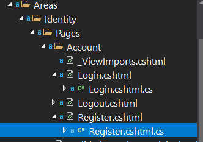

### Hidden .cs files

Register.cshtml
```csharp
@page
@model RegisterModel
@{
    ViewData["Title"] = "Register";
}

<h2>@ViewData["Title"]</h2>

<div class="row">
    <div class="col-md-4">
```


Generated file: Register.cshtml.cs


ASP.NET Core : Compréhension de la Génération de Register.cshtml.cs et son Rôle dans l'Inscription des Utilisateurs

Introduction :
ASP.NET Core, un cadre robuste et polyvalent pour le développement d'applications Web, offre diverses fonctionnalités pour simplifier le développement. Une de ces fonctionnalités est l'échafaudage, qui génère du code de base pour accélérer les tâches courantes. Dans cette discussion, nous plongerons dans le but et les mécanismes derrière la génération de Register.cshtml.cs et la classe associée RegisterModel.

1. Échafaudage dans ASP.NET Core :
   L'échafaudage automatise la création de code de base pour des tâches courantes telles que les opérations CRUD (Créer, Lire, Mettre à jour, Supprimer), l'authentification, etc. Il permet d'économiser du temps et des efforts aux développeurs en générant des structures de code initiales, qu'ils peuvent ensuite personnaliser selon leurs besoins.

2. Génération de Register.cshtml.cs :
   Le fichier Register.cshtml.cs est généré dans le cadre de l'échafaudage pour la fonctionnalité d'inscription des utilisateurs. Lors de l'échafaudage de l'authentification dans un projet ASP.NET Core, le framework crée ce fichier pour gérer la logique d'inscription des utilisateurs. Explorons pourquoi ce fichier est généré et son contenu :

3. Objectif de Register.cshtml.cs :
   Register.cshtml.cs sert de fichier code-behind pour la page Razor Register.cshtml. Il contient la logique responsable du traitement de la saisie de l'utilisateur pendant le processus d'inscription. Cette séparation des préoccupations est conforme au modèle architectural MVC (Modèle-Vue-Contrôleur), améliorant la maintenabilité et la scalabilité.

4. Exploration de Register.cshtml :
```csharp
@page
@model RegisterModel
@{
    ViewData["Title"] = "Register";
}
<h2>@ViewData["Title"]</h2>
```
   - `@page` : Indique que cette page Razor est associée à une route de page.
   - `@model RegisterModel` : Spécifie le type de modèle utilisé par cette page.
   - `@{ ... }` : Encadre le code C# pour définir le titre de la page.

5. Compréhension de la Classe RegisterModel :
   RegisterModel est une classe définie dans Register.cshtml.cs, servant de modèle pour la page d'inscription. Elle encapsule les données et les comportements liés à l'inscription des utilisateurs, y compris les champs de formulaire, la validation et le traitement de la soumission.

6. Anatomie de RegisterModel :
   Examinons la structure de RegisterModel et ses composants clés :

```csharp
public class RegisterModel : PageModel
{
    private readonly UserManager<ApplicationUser> _userManager;
    private readonly SignInManager<ApplicationUser> _signInManager;

    public RegisterModel(
        UserManager<ApplicationUser> userManager,
        SignInManager<ApplicationUser> signInManager)
    {
        _userManager = userManager;
        _signInManager = signInManager;
    }

    [BindProperty]
    public InputModel Input { get; set; }

    public string ReturnUrl { get; set; }

    [TempData]
    public string ErrorMessage { get; set; }

    public class InputModel
    {
        [Required]
        [EmailAddress]
        [Display(Name = "Email")]
        public string Email { get; set; }

        [Required]
        [DataType(DataType.Password)]
        [Display(Name = "Password")]
        public string Password { get; set; }

        [DataType(DataType.Password)]
        [Display(Name = "Confirm password")]
        [Compare("Password", ErrorMessage = "The password and confirmation password do not match.")]
        public string ConfirmPassword { get; set; }
    }
```
   - `UserManager` et `SignInManager` : Services fournis par ASP.NET Core Identity pour la gestion des utilisateurs et l'authentification.
   - `InputModel` : Représente la structure des données pour la saisie de l'utilisateur, y compris l'email, le mot de passe et la confirmation du mot de passe.
   - `[BindProperty]` : Attribut pour la liaison de modèle, remplissant automatiquement les propriétés de InputModel à partir des valeurs du formulaire.
   - `[TempData]` : Stocke les messages d'erreur à afficher à travers les redirections HTTP.
   - Les attributs de validation (`[Required]`, `[EmailAddress]`, `[DataType]`, `[Display]`) garantissent l'intégrité des données et fournissent une validation de saisie conviviale.

7. Constructeur de RegisterModel :
   Le constructeur injecte les dépendances UserManager et SignInManager requises pour la gestion des utilisateurs et l'authentification.

8. Conclusion :
   Register.cshtml.cs et RegisterModel sont des composants intégraux de l'échafaudage d'ASP.NET Core pour l'inscription des utilisateurs. En comprenant leur génération, leur structure et leur objectif, les développeurs acquièrent des connaissances sur le flux de travail d'authentification d'ASP.NET Core et peuvent personnaliser efficacement la fonctionnalité d'inscription pour répondre aux exigences du projet.

9. Autres sujets à explorer :
   - Personnalisation des formulaires et de la validation d'inscription des utilisateurs.
   - Implémentation de fonctionnalités d'inscription supplémentaires telles que CAPTCHA, confirmation par email ou processus d'inscription en plusieurs étapes.
   - Intégration de fournisseurs d'authentification tiers (par exemple, OAuth, OpenID Connect) pour offrir des options d'inscription des utilisateurs étendues.
 