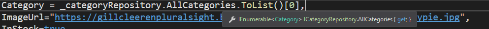
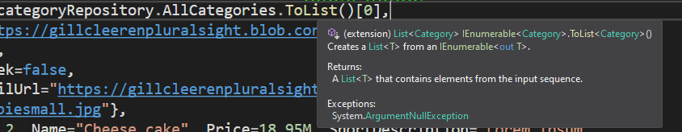

### .ToList()





```csharp
Category = _categoryRepository.AllCategories.ToList()[0],
```

## ASP.NET Core: Comprendre la méthode `.ToList()`

En développement ASP.NET Core, la méthode `.ToList()` est couramment utilisée pour convertir une collection énumérable en une liste. Cette méthode se trouve dans LINQ (Language Integrated Query), qui fait partie du framework .NET et fournit des capacités de requêtage à C#.

### Aperçu

La méthode `.ToList()` est principalement utilisée pour matérialiser une séquence en une `List<T>`. Elle est souvent utilisée dans des scénarios où vous devez effectuer plusieurs opérations sur les données, telles que le filtrage, le tri ou la projection, et souhaitez vous assurer que les données sont stockées en mémoire sous forme de liste pour un accès plus rapide.

### Syntaxe

```csharp
List<T> liste = énumérable.ToList();
```

### Paramètres

- `énumérable`: La séquence à convertir en liste.

### Exemple

Supposons que nous ayons une classe de repository nommée `RepositoryProduit` et que nous voulions récupérer la première catégorie d'une liste de catégories :

```csharp
Categorie premiereCategorie = _repositoryProduit.ToutesLesCategories().ToList()[0];
```

Dans cet exemple :
- `_repositoryProduit` : représente une instance d'une classe de repository responsable de la gestion des catégories.
- `ToutesLesCategories()` : est une méthode qui récupère toutes les catégories sous forme de collection énumérable.
- `.ToList()` : convertit la collection énumérable de catégories en une `List<Categorie>`.
- `[0]` : accède au premier élément de la liste, en supposant qu'il existe.

### Importance

1. **Matérialisation** : La méthode `.ToList()` matérialise les résultats de la requête en mémoire, permettant un accès plus rapide et réduisant les requêtes à la base de données dans les scénarios où les données doivent être accédées plusieurs fois.

2. **Exécution immédiate** : La méthode déclenche l'exécution immédiate de la requête LINQ. C'est crucial dans les scénarios où une exécution différée pourrait ne pas être souhaitable.

3. **Optimisation des performances** : Convertir une séquence en liste peut améliorer les performances, en particulier dans les scénarios impliquant de grands ensembles de données, en évitant l'énumération répétée de la séquence.

### Utilisations

- **Pagination** : Lors de la mise en œuvre de la pagination, la conversion des résultats de la requête en une liste permet de récupérer efficacement des pages spécifiques sans réinterroger la base de données.

- **Mise en cache** : Stocker les résultats de la requête en mémoire sous forme de liste peut faciliter les mécanismes de mise en cache, améliorant les performances de l'application en réduisant le besoin de requêtes répétitives à la base de données.

- **Manipulation des données** : Les listes offrent une plus grande flexibilité pour la manipulation des données par rapport aux collections énumérables, permettant des opérations telles que le tri, le filtrage et la modification.

### Alternatives

Bien que `.ToList()` soit couramment utilisée, il existe des méthodes alternatives en fonction des besoins spécifiques :

- `.ToArray()` : Convertit la séquence en un tableau.
- `.ToDictionary()` : Convertit la séquence en un dictionnaire.
- `.ToHashSet()` : Convertit la séquence en un ensemble de hachage.

### Conclusion

En développement ASP.NET Core, comprendre la méthode `.ToList()` est essentiel pour optimiser les performances et travailler efficacement avec les données. En convertissant les collections énumérables en listes, les développeurs peuvent tirer parti des avantages du stockage en mémoire et rationaliser les opérations de manipulation des données. Cependant, il est crucial d'utiliser cette méthode avec discernement, en tenant compte des compromis en termes de consommation de mémoire et de performances.