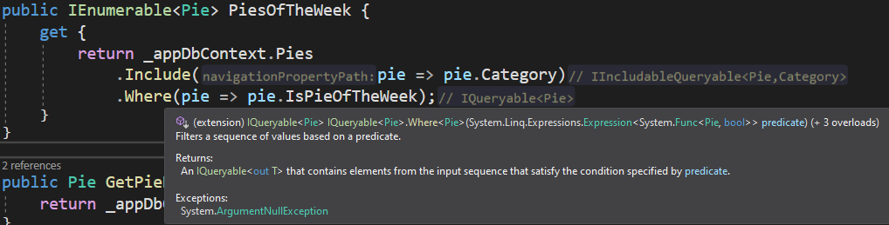

### `.Where<TSource>(this IQueryable<TSource> source, Expression<Func<TSource, int, bool>> predicate);`

```csharp
// Summary:
        //     Filters a sequence of values based on a predicate. Each element's index is used
        //     in the logic of the predicate function.
        //
        // Parameters:
        //   source:
        //     An System.Linq.IQueryable`1 to filter.
        //
        //   predicate:
        //     A function to test each element for a condition; the second parameter of the
        //     function represents the index of the element in the source sequence.
        //
        // Type parameters:
        //   TSource:
        //     The type of the elements of source.
        //
        // Returns:
        //     An System.Linq.IQueryable`1 that contains elements from the input sequence that
        //     satisfy the condition specified by predicate.
        //
        // Exceptions:
        //   T:System.ArgumentNullException:
        //     source or predicate is null.
        public static IQueryable<TSource> Where<TSource>(this IQueryable<TSource> source, Expression<Func<TSource, int, bool>> predicate);
```



# La Fonction `.Where()`

En ASP.NET Core, la fonction `Where` joue un rôle crucial dans le filtrage des données à partir de collections. Elle est couramment utilisée dans les requêtes LINQ (Language-Integrated Query) pour spécifier des critères de sélection d'éléments dans une séquence. Dans ce document Markdown, nous plongerons dans les détails de fonctionnement de la fonction `Where` et son application dans le développement ASP.NET Core.

## Compréhension de la Fonction `Where`

La fonction `Where` est une méthode d'extension LINQ qui filtre une séquence de valeurs en fonction d'une fonction prédicat. Elle évalue chaque élément de la séquence et ne retourne que ceux pour lesquels la fonction prédicat renvoie `true`.

### Syntaxe :

```csharp
IEnumerable<T> Where<TSource>(this IEnumerable<TSource> source, Func<TSource, bool> predicate)
```

- `source` : La séquence ou la collection d'entrée.
- `predicate` : Une fonction qui définit les critères de filtrage des éléments.

### Exemple d'utilisation :

```csharp
public IEnumerable<Tarte> ObtenirTartesDeLaSemaine()
{
    return _dbContext.Tartes
        .Include(tarte => tarte.Categorie)
        .Where(tarte => tarte.EstTarteDeLaSemaine);
}
```

Dans cet exemple :
- `_dbContext` : Représente le contexte de la base de données, qui fournit l'accès à la base de données sous-jacente.
- `Tartes` : Représente une collection d'entités de tarte dans la base de données.
- `Include` : Spécifie les données liées à inclure dans le résultat de la requête.
- `tarte => tarte.EstTarteDeLaSemaine` : Définit la fonction prédicat, filtrant les tartes marquées comme "Tarte de la semaine".

## Explication Détaillée

### Contexte de la Base de Données (`_dbContext`)

En ASP.NET Core, le contexte de la base de données (`_dbContext`) est responsable de la coordination de la fonctionnalité EF Core pour une base de données donnée. Il représente une session avec la base de données, permettant à l'application d'interroger et de sauvegarder des données.

### Collection de Tartes

La collection `Tartes` représente un DbSet dans le contexte de la base de données, généralement mappé à une table dans la base de données. Elle fournit un accès aux entités de tarte, permettant des opérations telles que les requêtes et les mises à jour.

### Inclusion de Données Liées (`Include`)

La méthode `Include` est utilisée pour spécifier les entités liées à inclure dans le résultat de la requête. Cela est particulièrement utile pour charger rapidement des données liées, évitant des allers-retours supplémentaires vers la base de données lors de l'accès à des entités liées.

### Fonction Prédicat (`tarte => tarte.EstTarteDeLaSemaine`)

La fonction prédicat définit la condition que chaque élément de la séquence doit satisfaire pour être inclus dans le résultat. Dans ce cas, elle vérifie si la propriété `EstTarteDeLaSemaine` de chaque entité de tarte est `true`, indiquant que la tarte est désignée comme "Tarte de la semaine".

## Notes Additionnelles

- La fonction `Where` peut être combinée avec d'autres opérations LINQ telles que `OrderBy`, `Select`, `First`, `Single`, etc., pour des requêtes plus complexes et des résultats personnalisés.
- L'utilisation de la fonction `Where` avec des expressions lambda offre une syntaxe concise et expressive pour spécifier des conditions de filtrage.
- Assurez-vous que le type retourné par la fonction prédicat correspond au type attendu par la séquence d'entrée pour éviter des erreurs de compilation.
- Les performances peuvent être optimisées en évitant les requêtes lentes et en minimisant le nombre d'allers-retours avec la base de données.

## Conclusion

La fonction `Where` en ASP.NET Core offre un mécanisme puissant pour filtrer les données en fonction de critères spécifiés. En tirant parti des requêtes LINQ et des fonctions prédicats, les développeurs peuvent récupérer efficacement des sous-ensembles de données à partir de collections ou de tables de bases de données. Comprendre comment utiliser la fonction `Where` est essentiel pour construire des applications Web réactives et basées sur les données en ASP.NET Core.